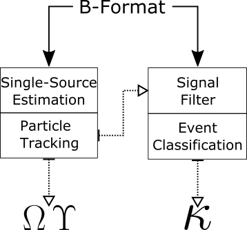
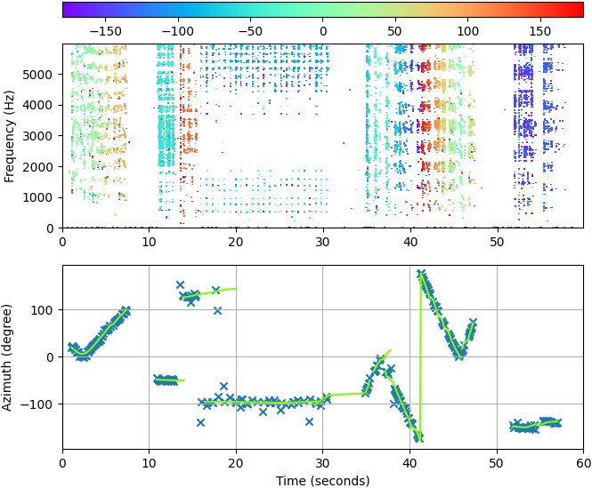

# DCASE 2020 - TASK 3 - APRI

This is our contribution to [DCASE2020 Task 3 Challenge]((http://dcase.community/challenge2020/task-sound-event-localization-and-detection)).

(C) 2020 Andrés Pérez-López and Rafael Ibañez-Usach.

This repository holds the implementation of the *Parametric Particle Filter (PAPAFIL)* method, as described in [1].

###### How does the method work?

*PAPAFIL* is based on four main building blocks: 
  1. Estimate single-source TF bins and compute their instantaneous narrowband DOA.
  2. Use a particle tracking system to transform DOAs into consistent event trajectories and activations.
  3. The B-Format input signal is filtered spatially and temporally with those annotations, producing monophonic event estimates.
  4. A class label is assigned to each event estimate using a single-class classifier based on GBM.

The architecture is depicted in the following Figure, where Omega and Ypsilon represen the localizationt and temporal activity, respectively,
and Kappa is the sound event class. 

An example of the output for steps 1. and 2. is plotted in the following Figure 
(which can be obtained in the code using the internal `debug` parameter).

  

More information on the method, including the evaluation metric results on the cross-validation development set, is provided in the related article [1].

## Repo Structure

 * **APRI** contains the files created in our contribution.
 * **seld-dcase2020** contains a fork of the [baseline system](https://github.com/sharathadavanne/seld-dcase2020) [2,3], with minor adaptations for our usage.
 * **multiple-target-tracking-master** contains a fork of the Matlab code which implements the [particle filter](https://github.com/sharathadavanne/multiple-target-tracking) [4].

## Dependencies
The following list enumerates the dependencies of the proposed method. 
Please check the baseline method repository for their specific requierements.  
* numpy
* scipy
* sklearn v0.23.0
* matplotlib
* soundfile (pysoundfile)
* librosa
* keras (I'm using v2.3.1)
* tensorflow (I'm currently using v2.0.0, since newest 2.1+ collides with that keras version)
* essentia (check https://essentia.upf.edu/installing.html)
* pandas
* matlab(*)

(*)The particle filter engine is coded in Matlab. Therefore, a valid instalation is required in order to run the localization system.
However, the matlab-python wrapper handles all the process, so you don't need to go out of your python IDE.
A python port of the library is not planned for the near future, although it would be a fantastic tool for the SELD community...

## Getting started

##### Configuration
1. Download the dataset, and place it in a suitable path in your computer
2. Go to `baseline/parameter.py` and set your user name (l. 11), the dataset paths (l. 104-118) and the matplotlib backend (l. 121-124).

##### Dataset generation
There are two different ways to generate the monophonic event dataset with which to train the models, which correspond to *PAPAFIL1* and *PAPAFIL2* methods [REF TODO]:
   1. Dataset of *PAPAFIL1* is obtained by just parsing the annotation files, and spatially filtering events according to the groundtruth labels. 
This is the purpose of the `generate_audio_from_annotations.py` script. 
   2. Conversely, *PAPAFIL2* dataset is created by actually using the parametric particle filter system, and it is implemented in `generate_audio_from_analysis.py`.
In both cases, the resulting datasets will be created in the same folder where the FOA dataset lays.  

##### Feature Extraction and Model Training

TODO RAFA

##### Localization and detection

As mentioned above, the particle filtering is implemented in Matlab.
The code, contained in `multple-target-tracking-master/func_tracking.m` is called from python.
The DOA estimates are passed as a temporary csv file, and the result events are retrieved as a .mat file with the same name im the same folder.

The paths in the matlab file are hardcoded; sorry for that. You will have to set them to point your actual paths. 

##### SELD

1. Different parameter configurations, organized as *presets*, can be described in `baseline/parameter.py`.
Each *preset* specifies different sub-systems to be used in the analysis, along with the selected parameter values: 
localization (`ld_method` and `ld_method_args`), beamforming mode (`beamforming_mode`), classification architecture and model (`class_method` and `class_method_args`), and optional postprocessing (`event_filter_activation`).  
Furthermore, 

2. The script `run.py` contains the main loop used to perform the SELD analysis in *evaluation* mode, according to the specified *preset*.
The output of the script is a set of annotation files, which will be created in a folder named after the *preset* used.
There are three main boolean options available:
    * `write`: enables output file writing; usually we want this feature activated.
    * `plot`: plots the groundtruth and estimated events of all output files for the given preset. Not recommended for full passes of the dataset.
    * `quick`: allows the script execution only in the files specified in the list `quick_audio_files`; useful for quick tests. 

3. Two complementary scripts provide helpful information from already computed output files:
    * `eval.py` computes the evaluation metrics of an existing set of output annotations, specified by *preset* name.
    * `plot.py` plots the groundtruth and estimated events on the list of selected files. 
    

## File description

##### APRI
###### scripts
* `compute_metrics.py`: mainly adapted from `baseline/metrics`, provides the evaluation metrics implementation.
* `data_preparation_event_number_mode.py` TODO RAFA
* `eval.py`: quick evaluation of an output annotation set.
* `event_class_model_training.py` TODO RAFA
* `event_class_prediction.py` TODO RAFA
* `event_number_model_training.py` TODO RAFA
* `generate_audio_from_analysis.py`: create the *PAPAFIL2* training set.
* `generate_audio_from_annotations.py`: create the *PAPAFIL1* training set.
* `generate_irs.py`: generate a set of IRs for data augmentation purposes.
* `get_audio_features.py`: TODO RAFA
* `get_data_augmentation.py`TODO RAFA
* `get_dataframes.py`TODO RAFA
* `get_model_utils.py`TODO RAFA
* `localization_detection.py`: implements the methods used for DOA estimation and particle filtering.
* `pipeline_feature_engineering.py`: TODO RAFA
* `pipeline_modelling.py` TODO RAFA
* `plot.py`: convenience script for result visualization
* `postprocessing.py` TODO RAFA
* `remove_near_observations.py` TODO RAFA
* `run.py`: main SELD script
* `training_batch_data_augmentation.py` TODO RAFA
* `training_batch_generate_audio_features.py` TODO RAFA
* `utils.py`: contains many useful methods for data handling, parametric analysis, plotting, etc.
###### folders
* `IR/`: the folder containing the IRs used for reverberant data augmentation, generated by [5].
* `models/`: holds the different machine learning model parameters and architectures
* `plot_paper/`: some scripts for generating plots for the articles
* `results/`: system output, with a folder for each preset
##### baseline

* `parameter.py`: main configuration script

##### multiple-target-tracking-master

* `func_tracking.m`: implements the particle filter.

## License

##### APRI

[Do What the Fuck You Want To Public License](LICENSE.md)

##### baseline

Except for the contents in the `metrics` folder that have [MIT License](seld-dcase2020/metrics/LICENSE.md). 
The rest of the repository is licensed under the [TAU License](seld-dcase2020/LICENSE.md).

##### multiple-target-tracking-master

[GNU GPL 2.0 or later](http://www.gnu.org/licenses/gpl-2.0.html)

(Note: actually, it is possible that the whole project should be converted into GPL because of this one, but I'm not really sure
how that affects other third party libraries, i.e. the baseline. Anyway, please contact me if you want to use anything from here, and we will see how to proceed).

## Bibliography

>[1] "PAPAFIL: a low complexity sound event localization and detection method with parametric particle filtering and gradient boosting".
Andrés Pérez-López and Rafael Ibañez-Usach.
Submitted to the Worshop on Detection and Classification of Acoustic Scenes and Events 2020 Workshop (DCASE2020).
	
> [2] "Sound event localization and detection of overlapping sources using convolutional recurrent neural network".
Sharath Adavanne, Archontis Politis, Joonas Nikunen and Tuomas Virtanen.
IEEE Journal of Selected Topics in Signal Processing (JSTSP 2018).
 
> [3] "Localization, Detection and Tracking of Multiple Moving Sound Sources with a Convolutional Recurrent Neural Network".
Sharath Adavanne, Archontis Politis and Tuomas Virtanen.
Workshop on Detection and Classification of Acoustic Scenes and Events (DCASE 2019)

> [4] "Rao-Blackwellized Monte Carlo data association for multiple target tracking".
Simo Särkkä, Aki Vehtari and Jouko Lampinen.
Proceedings of the seventh international conference on information fusion. Vol. 1. I, 2004.

> [5] "A Python library for Multichannel Acoustic Signal Processing." 
Andrés Pérez-López and Archontis Politis.
Audio Engineering Society Convention 148. Audio Engineering Society, 2020.